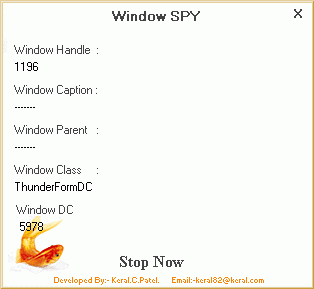



## Window\-SPY v 1\.0

### Description

This Code is For Knowing the Class, Handle, DC, Caption and Parent of a particular window. This is Very Powerful Feature if you want to make Tweakers or want to change the appearance of your Windows.
 
### More Info
 

             |
---                |---
**Submitted On**   |2003-07-15 10:48:12
**By**             |[Keral\.C\.Patel\.](https://github.com/Planet-Source-Code/PSCIndex/blob/master/ByAuthor/keral-c-patel.md)
**Level**          |Intermediate
**User Rating**    |4.3 (17 globes from 4 users)
**Compatibility**  |VB 6\.0
**Category**       |[Complete Applications](https://github.com/Planet-Source-Code/PSCIndex/blob/master/ByCategory/complete-applications__1-27.md)
**World**          |[Visual Basic](https://github.com/Planet-Source-Code/PSCIndex/blob/master/ByWorld/visual-basic.md)
**Archive File**   |[Window\-SPY1615427162003\.zip](https://github.com/Planet-Source-Code/keral-c-patel-window-spy-v-1-0__1-46948/archive/master.zip)

